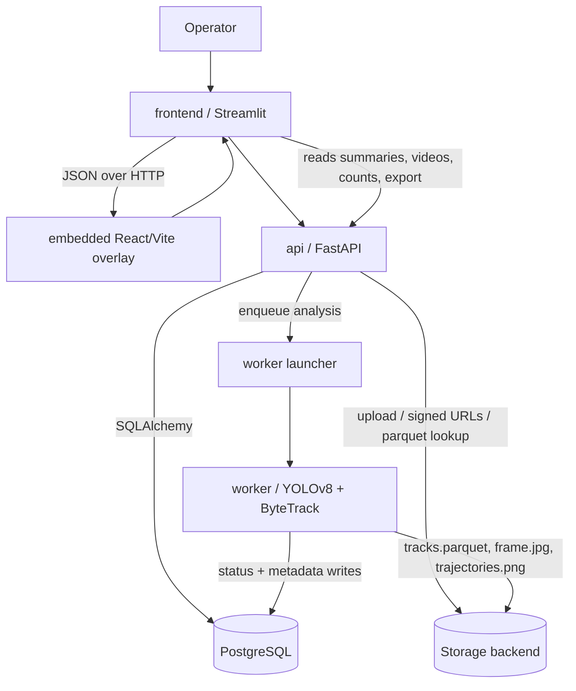

# Dataflow: Top Architecture

Status: [DONE]

This diagram shows the end-to-end flow across all modules.

## Invariants

- The UI never reads raw database state directly.
- The worker never serves operator requests.
- The API is the only module allowed to decide whether a video can transition from uploaded to queued, analyzing, analyzed, or error.
- Storage artifacts are immutable after generation unless the source video changes.
- The embedded overlay never bypasses the API when persisting counting-line changes.
