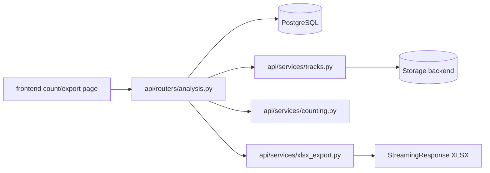

# Dataflow: Counting And Export

Status: [DONE]

This flow covers line selection, track loading, count computation, and XLSX generation.

## Rules

- All selected videos must belong to the same project.
- All selected videos must already be analyzed before counts are computed.
- Counting is purely derived from stored track data and line geometry; the worker is not involved.
