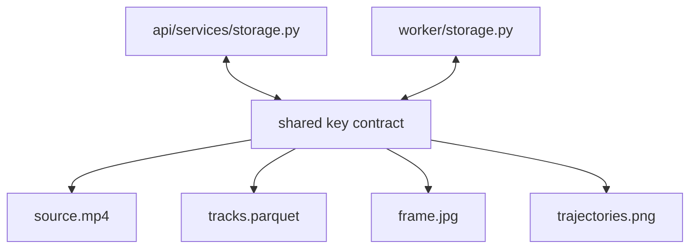

# Dataflow: Shared Storage Boundary

Status: [DONE]

This flow records how the API and worker stay aligned on artifact names and backend selection.

## Contract

- The API and worker must generate identical object keys for the same project/video pair.
- The worker produces artifacts; the API serves and derives from them.
- Storage backend selection is environment-driven and must not change the key format.
