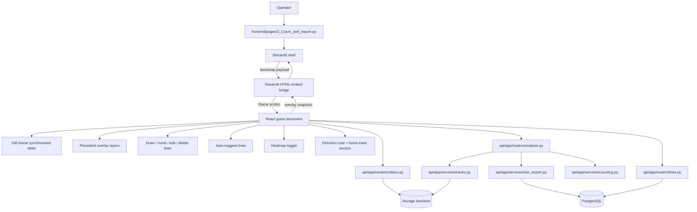

# Dataflow: Hybrid Counting-Line Overlay

Status: [IN_PROGRESS]

This flow defines the planned React/Vite viewport embedded into Streamlit for the advanced counting-line UX.

## Planned Behavior

- The Streamlit page hosts the current workspace and hands the overlay component the selected video set, saved lines, and rendering URLs.
- The React overlay keeps the viewport state locally so drag and scrub interactions remain immediate.
- The Python side remains the source of truth for persistence, count recomputation, and export.
- The host/guest bridge is JSON-only and message-based, so both sides can be independently reloaded without breaking the contract.
- The React overlay resyncs when the host sends a new bootstrap payload.
- The bridge shell only works when the React guest document can render; if the browser cannot load the guest, the page must present a degraded bridge state rather than pretending the overlay is connected.

## Module Boundaries

- Streamlit owns workspace selection, authentication context, and page composition.
- React owns viewport gestures, layer visibility, and synchronized frame navigation.
- FastAPI owns saved line persistence, track loading, counts, auto-suggest, heatmap generation, and export.
- The React guest document is an inline deployable boundary that must be embedded or served from the same deployment.

## Integration Signals

- Host bootstrap variable: `window.__TRAFFIC_COUNTER_HYBRID_VIEWPORT__`
- Host bootstrap message source: `traffic-counter-host-shell`
- Overlay snapshot postMessage source: `traffic-counter-hybrid-viewport`
- Local snapshot event: `traffic-counter:overlay-snapshot`
- Guest document source: bridge `srcdoc` payload or a browser-reachable asset origin used during development.
