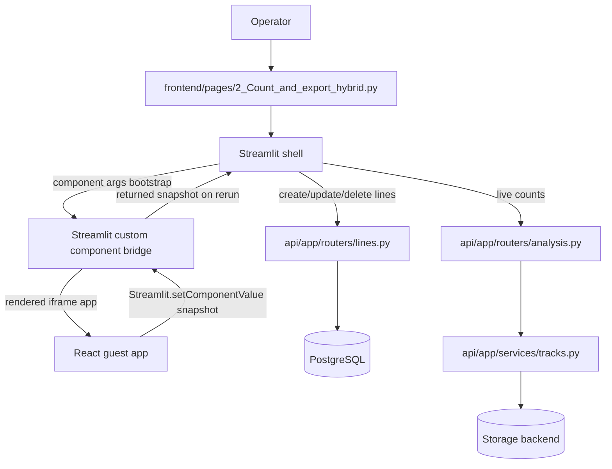

# Dataflow: Hybrid Counting-Line Overlay

Status: [DONE]

This flow defines the React/Vite counting-line viewport embedded through a Streamlit custom component bridge.

## Contract Constraints

- Bootstrap payload is JSON-only and project-scoped.
- Snapshot payload is JSON-only and must include line geometry and active layers.
- Host page is authoritative for persistence and count requests.
- React viewport never writes directly to API.

## Visualization Runtime Constraints

- Component frontend must call Streamlit ready/render lifecycle before relying on args.
- Production build must emit relative asset URLs from component `index.html` (`./assets/...`), not absolute `/assets/...`.
- Vite config must use `base: './'` for embedded component deployment.
- MIME mismatch on module script (`text/html` for `index-*.js`) is a hard failure and blocks viewport rendering.

## Optimization Rules

- Host must deduplicate snapshots by stable hash before issuing API mutations.
- Reconciliation must be idempotent across reruns.
- Line persistence should send only changed fields (`name`, `color`, `points`).
- Counts must execute only after reconciliation converges on authoritative line ids.

## Integration Signals

- Host bootstrap channel: Streamlit component args.
- Overlay snapshot channel: Streamlit.setComponentValue(...).
- Local host dedupe key: snapshot hash stored in Streamlit session state.
