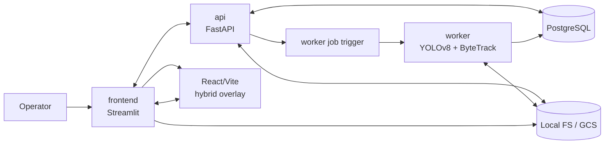

# High-Level Architecture

Status: [DONE]

The system has five cooperating planes:

1. Operator plane: Streamlit pages drive workspace creation, video upload, line drawing, counting, and export.
2. API plane: FastAPI owns project state, video metadata, line metadata, count computation, and export orchestration.
3. Worker plane: the GPU job analyzes a single video into durable track artifacts.
4. Storage plane: database rows, parquet outputs, frame images, and trajectory overlays persist across sessions.
5. Hybrid overlay plane: a Streamlit custom component hosts the React/Vite counting-line overlay and exchanges JSON bootstrap/snapshot payloads with the page shell.

## Architectural Responsibilities

- `frontend` is the interaction layer only. It hosts the Streamlit shell and mounts the counting-line overlay through a Streamlit custom component bridge, but it never computes counts locally and always delegates persistence and analysis to the API.
- `api` is the coordination layer. It validates project scope, owns metadata, triggers worker execution, and computes counts from stored tracks.
- `worker` is the analysis layer. It has one job: transform source video into track artifacts and analysis metadata.
- `storage` is the artifact layer. It holds source uploads, parquet tracks, rendered frame snapshots, and trajectory overlays.
- `hybrid overlay` is the interaction subplane for synchronized frame scrubbing, line manipulation, layer toggles, auto-suggest, and heatmap overlays.
- `streamlit component bridge` is the protocol boundary that carries the bootstrap payload into the React guest and relays overlay snapshots back to the host page shell.
- `react guest app` is the React/Vite overlay bundle mounted by the component bridge. In development it may be served from a Vite dev URL; in production it must use a built frontend bundle.

## Contract Boundaries

- Workspace selection is a frontend concern.
- Counting-line geometry is an API concern.
- Track generation is a worker concern.
- File naming and storage keys must be consistent between the API and worker storage helpers.
- Live drag/resize, viewport synchronization, and local overlay state are React concerns.
- The bridge must implement Streamlit custom component handshake correctly and include explicit component readiness.
- The React guest app must be reachable from the browser at render time; localhost URLs are development-only and not valid as production defaults.

## Bridge Failure Mode

If Streamlit reports `Unrecognized component API version: 'undefined'`, the component bridge handshake is broken and must be fixed before release. HTML embed can be used as a temporary diagnostics fallback only; it is not the target architecture for the counting-line overlay.

If browser console reports `Failed to load module script ... MIME type of "text/html"` for a hashed Vite asset (for example `index-*.js`), the component is serving HTML for a JS URL. In this architecture, that is a contract violation caused by absolute asset paths under a nested Streamlit component route. Production build must emit relative asset URLs (`./assets/...`) via Vite `base: './'`.

Console warnings about unsupported iframe features (`ambient-light-sensor`, `battery`, etc.) are treated as non-blocking browser compatibility noise unless they correlate with an actual render or handshake failure.

The architecture contract therefore requires:

- A Streamlit custom component wrapper in Python via declared component API.
- A React guest rendered inside the Streamlit component iframe.
- JSON-only bootstrap and snapshot payloads exchanged through Streamlit component value contracts.
- A deployment-time configured React guest source for development and a built asset path for production.

## Best-Practice References (2026-05-17)

- Streamlit components intro documents bi-directional component architecture, `declare_component`, and `setComponentValue` as the canonical bridge for Python <-> frontend state exchange: https://docs.streamlit.io/develop/concepts/custom-components/components-v1/intro
- Streamlit component limitations confirm iframe isolation boundaries and reinforce that complex UI must live inside the component iframe itself: https://docs.streamlit.io/develop/concepts/custom-components/components-v1/limitations
- Vite guide defines dev-server plus production-bundle split, which matches the requirement for dev URL in local work and static build assets for deployment: https://vite.dev/guide/
- Vite shared options and build docs define `base: './'` and relative base mode for embedded deployments, which is required for component routes that are not served from root: https://vite.dev/config/shared-options.html#base and https://vite.dev/guide/build#public-base-path
