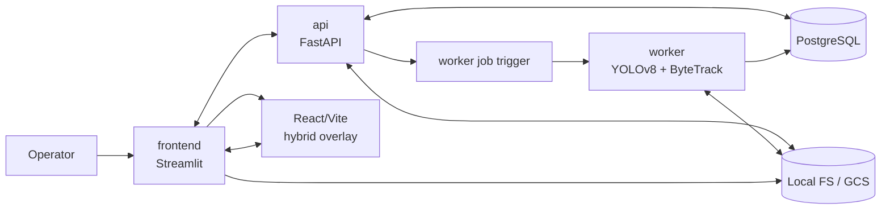

# High-Level Architecture

Status: [DONE]

The system has five cooperating planes:

1. Operator plane: Streamlit pages drive workspace creation, video upload, line drawing, counting, and export.
2. API plane: FastAPI owns project state, video metadata, line metadata, count computation, and export orchestration.
3. Worker plane: the GPU job analyzes a single video into durable track artifacts.
4. Storage plane: database rows, parquet outputs, frame images, and trajectory overlays persist across sessions.
5. Hybrid overlay plane: a Streamlit HTML embed hosts the React/Vite overlay shell and inlines a browser-reachable React guest document that exchanges JSON bootstrap/snapshot payloads with the page shell.

## Architectural Responsibilities

- `frontend` is the interaction layer only. It hosts the Streamlit shell and mounts the counting-line overlay through a Streamlit HTML embed bridge, but it never computes counts locally and always delegates persistence and analysis to the API.
- `api` is the coordination layer. It validates project scope, owns metadata, triggers worker execution, and computes counts from stored tracks.
- `worker` is the analysis layer. It has one job: transform source video into track artifacts and analysis metadata.
- `storage` is the artifact layer. It holds source uploads, parquet tracks, rendered frame snapshots, and trajectory overlays.
- `hybrid overlay` is the interaction subplane for synchronized frame scrubbing, line manipulation, layer toggles, auto-suggest, and heatmap overlays.
- `streamlit html bridge` is the protocol boundary that carries the bootstrap payload into the React guest and relays overlay snapshots back to the host page shell.
- `react guest document` is a browser-reachable inline guest document for the React/Vite bundle. In development it may be source-fed from a local Vite dev server; in production it must resolve to a served build asset origin or equivalent inline guest document.

## Contract Boundaries

- Workspace selection is a frontend concern.
- Counting-line geometry is an API concern.
- Track generation is a worker concern.
- File naming and storage keys must be consistent between the API and worker storage helpers.
- Live drag/resize, viewport synchronization, and local overlay state are React concerns.
- The bridge must render inside a Streamlit HTML embed without triggering the component API handshake.
- The React guest document must be reachable from the browser at render time; `localhost` is a development-only default and is not valid for production architecture.

## Bridge Failure Mode

If Streamlit reports `Unrecognized component API version: 'undefined'`, the page is still using the custom-component code path and must fall back to the HTML embed bridge. The current architecture contract requires a Streamlit HTML embed, not a custom component handshake, for the hybrid overlay path.

The architecture contract therefore requires:

- A Streamlit HTML embed wrapper in Python.
- A React guest rendered inside an iframe from a browser-reachable document.
- JSON-only bootstrap and snapshot payloads exchanged by `postMessage`.
- A deployment-time configured React guest origin, never an implicit `localhost` assumption in production.
