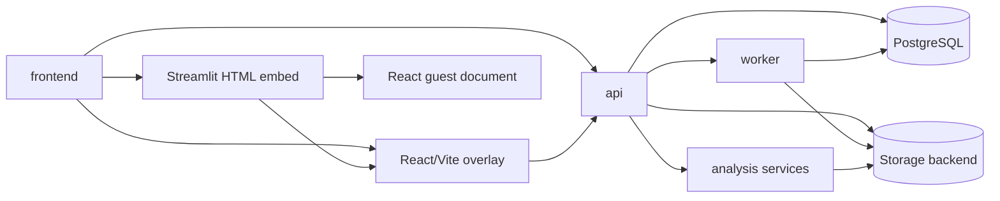

# Modules Overview

Status: [DONE]

## Module Map

| Module | Responsibility | Primary Files | Status |
|---|---|---|---|
| frontend | Operator UI, workspace selection, uploads, line drawing, export actions, and the hybrid overlay host | `frontend/streamlit_app.py`, `frontend/sidebar.py`, `frontend/pages/*`, `frontend/api_client.py` | [DONE] |
| api | Project, video, line, count, export, and worker-status HTTP surface | `api/app/main.py`, `api/app/routers/*` | [DONE] |
| worker | GPU/CPU job that turns one video into durable track artifacts | `worker/main.py`, `worker/pipeline.py` | [DONE] |
| storage | Shared object-key contract between API and worker | `api/app/services/storage.py`, `worker/storage.py` | [DONE] |
| analysis services | Counting, heatmap, track loading, suggestions, XLSX export | `api/app/services/*.py` | [DONE] |
| counting-line overlay | Hybrid React/Vite viewport embedded in Streamlit for advanced line editing | `frontend/pages/2_Count_and_export_hybrid.py` (planned), `frontend/hybrid_viewport/*` (planned) | [IN_PROGRESS] |
| streamlit html bridge | HTML embed wrapper that hosts the React guest iframe and transports bootstrap/snapshot JSON via `postMessage` | `frontend/hybrid_viewport/streamlit_bridge/*` | [IN_PROGRESS] |
| react guest document | Browser-reachable inline guest document for the React/Vite bundle that the bridge iframe loads | `frontend/hybrid_viewport/streamlit_bridge/index.html` and guest bundle assets | [IN_PROGRESS] |

## Inter-Module Dataflows

## Contract Notes

- `frontend` treats the API as the source of truth for all workspace state.
- `api` owns state transitions and derived outputs, including counts and exports.
- `worker` owns the expensive detection pipeline and never handles UI concerns.
- `storage` is the shared artifact layer; every key must be deterministic and stable.
- `counting-line overlay` owns only local viewport interaction; persistence and counting remain on the API.
- `streamlit html bridge` owns HTML embedding, iframe height management, and message relaying between Python and the React guest.
- `react guest document` owns the actual overlay UI bundle and must be reachable from the browser before the page can claim the overlay is connected.
