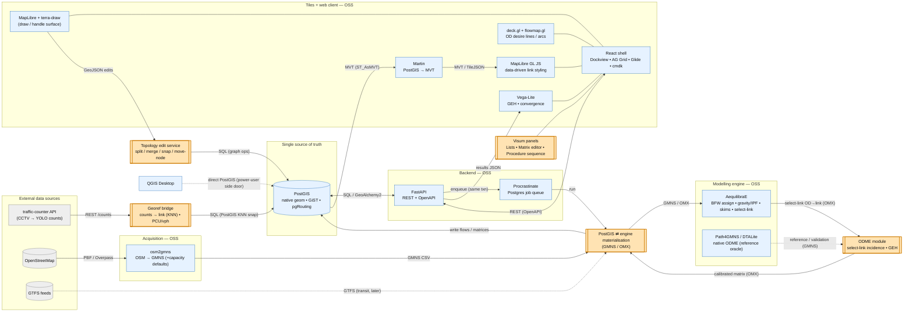

# macromodel — open-source tooling landscape & gap analysis

**A ground-up "buy vs build" map for the basic-Visum-clone-with-a-remote-backend vision.**

**Date:** 2026-06-12
**Scope:** the `macromodel` subsystem (the "lightweight cousin of PTV Visum")
**Relationship to [ADR 0001](../adr/0001-client-engine-and-data-architecture.md):** this report **expands** ADR 0001
from its 4 pillars to the full ~20-segment tool landscape, **completes the adversarial verification pass
that ADR 0001 §7 reported was killed mid-run**, and **corrects one ADR 0001 assumption** ("no engine
provides ODME" — a turnkey open-source ODME *does* exist in the GMNS ecosystem; see §6).
**Optimised for:** best long-term architectural fit. Demo speed, migration cost, and "keep-Solara
incrementally" framing are deliberately **out of scope** here (they belong in a sequencing plan, not in a
target-architecture map).

---

## 0. TL;DR — the seven things that matter

1. **The whole stack is buyable as permissively-licensed (MIT/BSD/Apache) open source *except five
   things we must build ourselves.*** The five genuine gaps are: **(a) topology-aware network editing**,
   **(b) the ODME calibration module**, **(c) the counts→link georeferencing bridge**, **(d) PostGIS⇄engine
   materialisation**, and **(e) the assembled Visum UI panels** (lists / matrix editor / procedure
   sequence). Everything else is adopt-and-wire.

2. **There are two viable engine "lanes," and they fork on the interchange format** (§6):
   - **AequilibraE / OMX lane** — mature (Production/Stable, 10-yr, Cython), gives BFW static
     equilibrium + gravity/IPF + skims + **select-link**, and OMX is *the bridge to/from commercial
     Visum/EMME*. **But it has no ODME and no mode-choice — we build both.**
   - **GMNS / Path4GMNS / DTALite lane** — **ships a turnkey, count-calibrating ODME** (`conduct_odme`),
     GMNS-native, Path4GMNS is Apache-2.0. **But it's smaller/younger and GMNS-CSV-centric (not OMX).**

3. **Turnkey open-source ODME exists — but only in the GMNS lane.** This *corrects ADR 0001*. It does
   **not** exist in AequilibraE. Recommendation: **keep ODME as our own engine-agnostic module built on
   AequilibraE select-link incidence, and use Path4GMNS `conduct_odme` as a reference/validation oracle**
   (both speak GMNS, so cross-checking is cheap).

4. **Topology-aware web map editing is the single biggest build.** *No* open web library (mapbox-gl-draw,
   terra-draw, Leaflet-Geoman free, @deck.gl-community/editable-layers) models shared nodes, split-link-
   creates-node, merge, or move-node-links-follow — they all edit independent GeoJSON features with at
   best *coordinate* snapping. The proven architecture (iD/Rapid + the OSM data model) is **an explicit
   node/link entity graph with a topology-action service, decoupled from a WebGL draw/handle surface.**

5. **The web rendering + UI shell is "solved by composition" of mature MIT/BSD/Apache libraries:**
   PostGIS → **Martin** (MVT/TileJSON) → **MapLibre GL JS** (data-driven link choropleths) +
   **deck.gl/flowmap.gl** (OD desire lines) + **Dockview** (docking) + **AG Grid Community** (lists) +
   **Glide Data Grid** (the big editable matrix) + **cmdk** (procedure launcher) + **Vega-Lite** (GEH /
   convergence). All permissive.

6. **The job runner should be Procrastinate (PostgreSQL-backed).** Since we already run PostGIS, it adds
   the queue *inside the existing database* — no Redis/RabbitMQ to operate — with transactional enqueue and
   cooperative cancel/abort, exactly what long assignment/ODME runs need. (Avoid `arq` — maintenance-only.)

7. **The open interchange standards are the spine: GMNS for networks, OMX for matrices, MVT for tiles.**
   Standardising on these is what lets best-of-breed tools interoperate and what bridges to/from
   commercial Visum/EMME.

---

## 1. Method & how to read this

This report was produced with the deep-research harness: the vision was decomposed into functional
segments, five parallel research agents (angles A–E) fetched **primary** sources (official docs, GitHub
source/changelogs, PyPI/npm, standards pages) and returned falsifiable, cited claims, and a dedicated
**adversarial verification agent** re-checked the load-bearing claims against source code. Confidence tags
(`HIGH/MED/LOW`) are the agents' grades; `[Nx]` marks natural cross-corroboration (N independent agents
hitting the same primary source). The verification verdicts are in **§8**.

Read **§3** for the one-screen matrix, **§4** for the integration diagram, **§5** for per-segment detail,
**§6** for the central ODME/engine decision, **§7** for the build-vs-buy recommendations.

---

## 2. The vision, decomposed into functional segments

The vision is a lightweight, open PTV Visum with a remote backend: build/edit a georeferenced road
network → define zones + a 4-step demand model (generation, gravity/IPF distribution, logit mode choice,
assignment) → georeference real traffic counts onto links → **calibrate the OD matrix to those counts
(ODME)** → inspect results on an interactive web map (link-flow choropleths, OD desire lines, GEH
dashboards). Counts arrive from the separate **traffic-counter** app (CCTV→YOLO→counts) over REST.

That decomposes into ~20 functional segments, grouped into five research angles:

- **A — Modelling engines:** trip generation, distribution, mode choice, assignment, **ODME**, skims.
- **B — Data & standards:** geospatial datastore, network interchange standard, OD-matrix format, network
  acquisition/import, transit feeds.
- **C — Rendering:** vector-tile serving, web map client, results visualisation.
- **D — UI:** multi-panel shell, attribute lists, matrix editor, command palette, **web geometry editing**.
- **E — Platform:** API framework, job orchestration, scenario versioning, deployment, auth.

---

## 3. The segment → tool → gap matrix (the spine)

Coverage = how completely the best OSS tool fills the segment. **Status** = where our *current* code sits
(✅ built · 🟡 partial · ⬜ none). **Call** = the long-term-fit recommendation.

| # | Segment | Best-fit OSS tool(s) | Coverage | Native interface | The gap *we* build | Status | Call |
|---|---|---|---|---|---|:--:|:--:|
| 1 | Geospatial datastore | **PostGIS** (+ GeoAlchemy2, pgRouting) | full | native `geometry`+GiST, `<->` KNN, `ST_AsMVT` | schema; GeoJSON-in-JSON → native-geom migration | 🟡 | **buy** + migrate |
| 2 | Network interchange standard | **GMNS** | full | GMNS CSV tables | map our model ↔ GMNS ↔ PostGIS | ⬜ | **buy** (adopt) |
| 3 | OD-matrix format | **OMX** (`openmatrix`) | full | HDF5 + NumPy | zone-index conventions | ⬜ (we use parquet) | **buy** (= Visum bridge) |
| 4 | Network acquisition (import) | **osm2gmns** / OSMnx | full→partial | OSM→GMNS / graph+GDF | capacity calibration, conflation | 🟡 (osmnx) | **buy** |
| 5 | **Web network editing (topology)** | MapLibre + **terra-draw** (handles only) | **none** (topology) | GeoJSON edit events | **node/link graph + split/merge/snap/move-node** | 🟡 (hand-rolled) | **BUILD** ⭐ |
| 6 | Trip generation | *(no OSS module)* | none | — | productions/attractions module | ✅ | **build** (keep) |
| 7 | Trip distribution (gravity/IPF) | **AequilibraE** | full | OMX matrices + marginals | — (adopt) | ✅ (ours) | **buy** (adopt) |
| 8 | Mode choice (logit) | biogeme (*estimation* only) | none/partial | — | apply module (+ optional biogeme calibration) | ✅ (binary) | **build** |
| 9 | Traffic assignment (static UE) | **AequilibraE BFW** | full | SQLite project + OMX | static-vs-dynamic policy | ✅ (UXsim, meso) | **buy** (AEQ); UXsim = optional dynamic |
| 10 | **ODME (calibrate to counts)** | **Path4GMNS `conduct_odme`** (GMNS) · *none in AEQ* | full (GMNS) / none (AEQ) | GMNS `measurement.csv` / AEQ select-link | engine-agnostic ODME on select-link incidence | ✅ (path-mult.) | **BUILD** ⭐ (buy as oracle) |
| 11 | Skims / shortest paths | **AequilibraE** / pgRouting / networkx | full | OMX / SQL | — | ✅ (networkx) | **buy** |
| 12 | Matrix storage + editing UI | **OMX** + **Glide Data Grid** | full | HDF5 / React callback grid | wire grid ↔ matrix store | 🟡 (solara.DataFrame) | **buy** + assemble |
| 13 | **Counts ingest + georef bridge** | *(no OSS)* — PostGIS KNN + traffic-counter REST | none (turnkey) | REST + `<->` SQL | the bridge itself | ✅ (ours) | **BUILD** ⭐ (keep) |
| 14 | Backend API framework | **FastAPI** | full | REST/OpenAPI/ASGI | — | ✅ | **buy** |
| 15 | Long-running job orchestration | **Procrastinate** (Postgres) | full | Postgres queue + LISTEN/NOTIFY | `runs` table, progress/cancel, SSE/poll endpoint | ⬜ (synchronous) | **buy** + wire |
| 16 | Vector-tile serving | **Martin** | full | MVT + TileJSON | scenario-filtered SQL tile functions | ⬜ (raster basemap) | **buy** |
| 17 | Web map client | **MapLibre GL JS** + **deck.gl** + **flowmap.gl** | full | MVT + GeoJSON + Style Spec | style ramps; OD-matrix→arc shaping | ⬜ (ipyleaflet) | **buy** + assemble |
| 18 | UI shell / multi-panel workspace | **Dockview** + **AG Grid** + **Glide** + **cmdk** + react-map-gl | full | React components | **assemble the Visum panels** | ⬜ (Solara 1-page) | **buy** + **BUILD** panels ⭐ |
| 19 | Results visualisation | **deck.gl/flowmap.gl** + **Vega-Lite** | full | GeoJSON / JSON specs | the dashboards | 🟡 (matplotlib) | **buy** + assemble |
| 20 | Scenario management / versioning | *(no turnkey web OSS)* | partial (AEQ desktop) | — | `scenario_id` + copy-on-write model | 🟡 | **build** |
| 21 | Deployment / packaging | **Docker** / Cloud Run + **Cloud SQL PostGIS** | full | containers / managed PG | cloud manifests | 🟡 (compose) | **buy** |
| 22 | Auth / multi-tenancy *(v1: out of scope)* | **Keycloak** / FastAPI-Users | full | OIDC/OAuth2 | integration only | ⬜ | **buy** (later) |

⭐ = one of the five genuine "we build it ourselves" gaps.

---

## 4. The integration architecture (where tools interface natively vs. where our code completes the vision)

**Legend:** blue = adopted OSS tool · **amber `[[ ]]` = our code filling a gap** · solid labelled edge =
**native interface** (the format/protocol that lets two tools connect with no glue) · dashed edge =
reference/optional/side-door.

*Rendered copies (for viewers that don't render Mermaid): [`tooling-landscape-diagram.svg`](tooling-landscape-diagram.svg) · [`tooling-landscape-diagram.png`](tooling-landscape-diagram.png). Source: [`tooling-landscape-diagram.mmd`](tooling-landscape-diagram.mmd).*

**How to read it:** every *solid labelled* edge is a connection two off-the-shelf tools make natively
through an open format — PostGIS→Martin via `ST_AsMVT`/MVT, Martin→MapLibre via TileJSON, materialisation→
AequilibraE via GMNS/OMX, FastAPI↔PostGIS via SQLAlchemy/GeoAlchemy2. The **amber nodes are the only
places we write real domain code**: the georef bridge, the PostGIS⇄engine materialisation, the ODME
module, the topology edit service, and the assembled Visum panels. The dashed edges are the *reference*
ODME oracle (Path4GMNS) and the *power-user side door* (QGIS editing PostGIS directly — free, no plugin).

---

## 5. Per-segment findings (with citations)

### 5.A — Modelling engines (distribution · mode choice · assignment · ODME · skims)

- **AequilibraE is the mature open core for the static 4-step.** It provides four static traffic-assignment
  algorithms — MSA, Frank-Wolfe, Conjugate FW, and **Biconjugate Frank-Wolfe (BFW)** — with BFW documented
  as "the fastest converging link-based traffic assignment algorithm used in practice" and the recommended
  default; it is multi-class. `[HIGH][2x]`
  (https://www.aequilibrae.com/develop/python/traffic_assignment/traffic_assignment_insights.html)
- **It also natively does trip distribution (synthetic gravity + IPF/Furness), network skims, and
  select-link analysis** (select-link since v0.8.1, producing per-link OD-contribution matrices). `[HIGH]`
  (https://www.aequilibrae.com/qgis/latest/menus_in_detail/tripdistribution.html , https://www.outerloop.io/blog/20230404_select_link/)
- **AequilibraE has NO ODME and NO 4-step mode-choice module.** A repo code search for `odme / "matrix
  estimation" / calibrate / "traffic counts"` returns **0 hits**; the project DB is "deliberately
  unstructured" because "there is no pre-defined demand model available." It has *route* choice (path-size
  logit) but not *mode* split. `[HIGH][verified]`
  (https://github.com/AequilibraE/aequilibrae , https://www.aequilibrae.com/latest/python/aequilibrae_project.html)
- **It stores its network as SQLite/SpatiaLite and matrices as AEM/OMX, and imports/exports GMNS
  (`create_from_gmns` / `export_to_gmns`) and OSM** — so it is GMNS- and OMX-interoperable but has **no
  PostGIS connector** (a per-run PostGIS→project materialisation step is required). Current **v1.6.2
  (2026-04-07)**, Production/Stable, Cython-accelerated, custom business-friendly licence. `[HIGH]`
  (https://www.aequilibrae.com/latest/python/_auto_examples/network_manipulation/plot_export_to_gmns.html , https://pypi.org/project/aequilibrae/)
- **Turnkey open-source ODME exists in the GMNS ecosystem.** **Path4GMNS** ships `conduct_odme(ui,
  odme_update_num)` (docstring: "calibrate traffic assignment results using traffic observations") +
  `read_measurements()` reading counts from `measurement.csv`; it runs a path-based UE/column-generation
  first to build the path pool, then adjusts demand to the counts. ODME is "available with v0.9.9 and
  higher"; current **v0.10.0 (2025-12-16)**, **Apache-2.0**, and it can wrap the **C++ DTALite** engine.
  `[HIGH][verified]`
  (https://github.com/jdlph/Path4GMNS/blob/master/path4gmns/odme.py , https://path4gmns.readthedocs.io/en/latest/usecases.html)
- **DTALite** (GMNS-native mesoscopic DTA, FHWA-backed) also has OD demand estimation, but is **GPL-3.0**
  (copyleft) and C++. The licence asymmetry is real and material: **Path4GMNS Apache-2.0 vs DTALite
  GPL-3.0**. `[HIGH][verified]`
  (https://github.com/asu-trans-ai-lab/DTALite/blob/main/LICENSE , https://github.com/jdlph/Path4GMNS/blob/master/LICENSE)
- **UXsim** (our current engine) is a **mesoscopic *dynamic*** simulator (DUE/DSO approximate solvers) —
  excellent and hackable (MIT, v1.13.0) but **dynamic-only, no static UE, no ODME, no GMNS/OMX I/O**. Keep
  it as the *optional dynamic* path, not the static core. `[HIGH]` (https://github.com/toruseo/UXsim)
- **SUMO** (EPL-2.0, micro) offers count-based calibration via `routeSampler`/`dfrouter`/Cadyts and
  `marouter` macro assignment ("UE not yet implemented"), but is XML-toolchain-heavy and route-flow-centric
  rather than matrix-centric — a poor fit for a clean matrix/SQLite/web core. **MATSim** (GPLv2, Java,
  agent-based) is too heavy for a static clone. `[HIGH/MED]`
  (https://sumo.dlr.de/docs/marouter.html , https://www.matsim.org/)
- **Mode choice is the weakest-covered segment across *all* engines** — none ships a configurable 4-step
  mode-split logit; estimation can use **biogeme**, application is custom. `[HIGH]`

### 5.B — Data & interchange standards

- **PostGIS native geometry is non-negotiable** for GiST spatial indexing, `<->` KNN (snap counts→links
  with no magic radius), `ST_AsMVT` in-DB tiles, and pgRouting skims. **GeoJSON-in-a-JSON-column cannot be
  GiST-indexed as geometry** → KNN/`ST_DWithin`/`ST_AsMVT` fail or full-scan. Promote our geometry from
  JSON to native columns. `[HIGH]`
  (https://postgis.net/workshops/postgis-intro/knn.html , https://postgis.net/docs/ST_AsMVT.html)
- **GeoAlchemy2** (v0.20.0, works with SQLAlchemy 2.0) is the standard way to get native PostGIS columns in
  an ORM. ⚠ **Flag:** async/psycopg3 spatial-type handling is inherited from SQLAlchemy and under-documented
  in GeoAlchemy2 — verify before relying on async sessions. `[HIGH / MED on async]`
  (https://geoalchemy-2.readthedocs.io/ , https://pypi.org/project/GeoAlchemy2/)
- **GMNS (General Modeling Network Specification)** is the de-facto open **network** interchange standard
  *within open tooling* — governed by the Zephyr Foundation (Volpe/FHWA), CSV `node`/`link` core + optional
  zone/lane/movement/signal tables, and read/written by **osm2gmns, Path4GMNS, DTALite, and AequilibraE**.
  Nuance: commercial Visum/EMME don't round-trip GMNS the way they do OMX. `[HIGH]`
  (https://github.com/zephyr-data-specs/GMNS , https://zephyr-data-specs.github.io/GMNS/)
- **OMX (Open Matrix)** is the de-facto open **OD-matrix** format (HDF5; `openmatrix` Python API), and —
  critically — **the bridge to/from commercial packages**: the osPlanning wiki states "all major commercial
  travel modeling packages now include native support for OMX" and hosts per-package support pages for
  **VISUM, EMME, TransCAD, Cube, SATURN**. `[HIGH / PARTIAL on the exact 5-package list]`
  (https://github.com/osPlanning/omx/wiki)
- **OSM import:** **osm2gmns** is the best single-step OSM→routable-GMNS path and **infers capacity/lanes/
  speed by facility type** (coarse defaults — calibrate them). **OSMnx/pyrosm/osm2pgsql do *not* infer
  capacity** — capacity is the common import gap regardless of tool. `[HIGH]`
  (https://github.com/jiawlu/OSM2GMNS , https://osmnx.readthedocs.io/en/stable/user-reference.html)
- **Visum `.ver`/EMME are proprietary** — no open native I/O. The realistic bridges are **OMX (matrices)**
  and **GMNS (networks)**; accept that vendor project files stay locked. `[HIGH]`
  (https://support.ptvgroup.com/en-us/knowledgebase/article/KA-04715)

### 5.C — Tiles, web client, visualisation

- **Martin** (MapLibre org, Rust, Apache-2.0/MIT, v1.10.x) serves **MVT** straight from PostGIS tables *and*
  SQL functions, auto-publishes **TileJSON** per source, and is the **fastest** PostGIS→MVT server in
  independent benchmarks. Function sources (z/x/y + JSON params → MVT `bytea`) are the clean hook for
  **scenario-filtered / recoloured** tiles. `pg_tileserv` (Go) is a simpler but slower fallback; PostGIS
  `ST_AsMVT` is the DIY escape hatch. `[HIGH][2x]`
  (https://github.com/maplibre/martin , https://maplibre.org/martin/)
- **MapLibre GL JS** (BSD-3) is the de-facto open web-map renderer, with **data-driven line styling**
  (width/colour by attribute via Style-Spec expressions) — directly suited to link-volume / V·C
  choropleths. `[HIGH]` (https://maplibre.org/maplibre-gl-js/docs/examples/style-lines-with-a-data-driven-property/)
- **deck.gl** (MIT) provides `ArcLayer`/`LineLayer`/`PathLayer`/`TripsLayer` for OD desire lines and
  animated flows, and integrates with MapLibre via **`MapboxOverlay`** (overlaid *or* interleaved). The
  canonical `ArcLayer` example is literally transit OD. `[HIGH]`
  (https://deck.gl/docs/api-reference/layers/arc-layer , https://deck.gl/docs/api-reference/mapbox/mapbox-overlay)
- **flowmap.gl** (Apache-2.0, maintained under visgl) is the higher-level OD flow-map layer (clustering,
  fading, animated direction). ⚠ **Licence trap:** the *FlowmapBlue app* is CC-BY-NC (non-commercial) — use
  the **library**, not the app; or hand-roll with deck.gl `ArcLayer` for full control + lower bus-factor
  risk (flowmap.gl is niche, ~136★). `[HIGH]` (https://github.com/visgl/flowmap.gl , https://www.flowmap.blue/credits)
- **Charts:** GEH scatter and convergence are plain tabular charts — **Vega-Lite** (BSD-3, declarative,
  `react-vega`) is the dashboard default; **Observable Plot** (ISC) for quick exploratory charts. No
  transport-specific charting lib needed. `[HIGH]` (https://github.com/vega/vega-lite)
- **Precedents (reference, not dependencies):** **kepler.gl** (MapLibre+deck.gl OD viz, heavyweight
  monolith) and **SimWrapper** (deck.gl dashboards over MATSim/ActivitySim outputs, file-based). `[MED]`

### 5.D — UI shell & web geometry editing

- **The shell is solved by composition of mature MIT libraries:** **Dockview** (zero-dep React docking —
  tabs/groups/floating/popout, category leader by downloads) + **AG Grid Community** (**MIT, free for
  production** — editing/sorting/filtering/virtualisation; *range-fill / server-row-model are Enterprise*)
  for Lists + **Glide Data Grid** (MIT, canvas, millions of cells, built-in edit/copy-paste/fill-handle) for
  the big editable **OD matrix** + **cmdk** (MIT) for the procedure/command launcher + **react-map-gl /
  @vis.gl/react-maplibre** to embed MapLibre. `[HIGH]`
  (https://dockview.dev/ , https://www.ag-grid.com/react-data-grid/community-vs-enterprise/ , https://github.com/glideapps/glide-data-grid , https://github.com/pacocoursey/cmdk)
- ⚠ **Glide Data Grid is only semi-actively maintained** (last release Feb 2024) — viable but watch
  staleness. `[MED]`
- **THE BIG GAP — no open web library does graph/topology-aware editing.** mapbox-gl-draw (needs
  third-party plugins even for snapping), **terra-draw** (Select-mode vertex edit + same-mode snap, but
  *explicitly no split-line, no merge, no shared-node*), **Leaflet-Geoman free** (snap/split/shared-vertex
  "pinning" are **Pro-only**, €999+/seat, and even Pro pinning is coordinate-coincidence not a node graph),
  and **@deck.gl-community/editable-layers** (`SplitPolygonMode` splits **polygons only**, no split-LINE,
  no shared nodes; "semi-maintained") **all edit independent GeoJSON features.** `[HIGH][verified]`
  (https://github.com/JamesLMilner/terra-draw/blob/main/guides/4.MODES.md , https://geoman.io/pricing , https://nebula.gl/docs/api-reference/modes/overview/)
- **The proven architecture** (from the OSM data model + **iD**'s `modules/actions/` — `split/join/merge/
  connect/disconnect/move_node` operations on an entity graph — and **Rapid**, which renders with PixiJS/
  WebGL over iD's graph engine): **an explicit node/link entity graph with a dedicated topology-action
  service, decoupled from a WebGL draw/handle surface.** Topology lives server/store-side; the draw library
  is only an input surface. `[HIGH]`
  (https://github.com/openstreetmap/iD/tree/develop/modules/actions , https://wiki.openstreetmap.org/wiki/Node , https://github.com/facebook/Rapid)
- **No mature open *web* road-network editor exists to adopt wholesale** (netedit/JOSM/QGIS are desktop;
  iD/Rapid are OSM-domain). Hence the pragmatic split: **a purpose-built web editor for everyday modeller
  ops + QGIS as a power-user side door** for heavy GIS/topology work over the same PostGIS. `[MED→HIGH]`

### 5.E — Backend, jobs, scenarios, deployment

- **FastAPI** is the API layer (ASGI + Pydantic + OpenAPI), no contest. Its `BackgroundTasks` is
  **unsuitable** for model runs (in-process, no progress/cancel/durability). `[HIGH]` (https://fastapi.tiangolo.com/)
- **Recommended job runner: Procrastinate (PostgreSQL-backed, MIT).** Because we already run PostGIS, it
  puts the queue **inside the existing database — no Redis/RabbitMQ to operate** — with **transactional
  enqueue** (queue a run in the same txn that writes its inputs) and **cooperative cancel + abort**
  (`JobAborted` / `asyncio.CancelledError`) for long assignment/ODME loops. Jobs are SQL-inspectable, so a
  `GET /runs/{id}` status endpoint is a trivial query. `[HIGH][verified]`
  (https://github.com/procrastinate-org/procrastinate , https://procrastinate.readthedocs.io/en/stable/howto/advanced/cancellation.html)
  - **Avoid `arq`** despite its elegant async/FastAPI fit — its repo is **"in maintenance only mode."**
    **Fallbacks:** RQ (best status/meta/cancel ergonomics of the Redis options) or Celery (heaviest, most
    ecosystem). `[HIGH]` (https://github.com/python-arq/arq)
  - **No queue ships a numeric progress channel** — surface progress via a `progress`/`stage` column on
    your own `runs` table, exposed through polling (or an SSE upgrade). `[HIGH]`
- **Execution model:** for infrequent *heavy* runs, keep Procrastinate as the control plane but dispatch
  compute to a **Cloud Run Job** (up to 7-day tasks, scale-to-zero, per-run sizing) instead of a fat
  always-on worker. Managed **PostGIS is available on Cloud SQL / AlloyDB**. `[HIGH/MED]`
  (https://docs.cloud.google.com/run/docs/configuring/task-timeout , https://docs.cloud.google.com/sql/docs/postgres/extensions)
- **Scenario versioning is largely custom for a web app.** AequilibraE *does* have scenarios (clone/empty)
  but they're **single-file SQLite/desktop**, not a multi-user server store; "git-for-data" **DoltgreSQL**
  is beta and **can't host PostGIS** (no extensions). Build it from general patterns — **`scenario_id` +
  parent-pointer copy-on-write** is the simplest fit. `[HIGH]`
  (https://github.com/AequilibraE/aequilibrae/releases , https://github.com/dolthub/doltgresql)
- **Auth/multi-tenancy** (out of scope for v1): **Keycloak** (OIDC, realm-per-tenant) or in-app
  **FastAPI-Users**. `[MED]`

---

## 6. The headline decision: two engine lanes & where ODME lives

The most consequential architectural call is the engine/interchange lane, because it determines whether
**ODME is buy or build** and which interchange format is canonical.

| | **Lane 1 — AequilibraE / OMX** | **Lane 2 — GMNS / Path4GMNS (+DTALite)** |
|---|---|---|
| Static UE assignment | ✅ BFW (mature, Cython) | ✅ column-generation UE |
| Distribution (gravity/IPF) | ✅ native | ⚠ thinner (demand synthesis) |
| Mode choice | ❌ build | ❌ build |
| Skims / select-link | ✅ select-link OD→link | ✅ paths |
| **ODME** | ❌ **none — we build** | ✅ **`conduct_odme` turnkey** |
| Matrix format | **OMX** (= Visum/EMME bridge) | GMNS `measurement.csv` |
| Maturity / community | Production/Stable, 10-yr, QGIS plugin | younger, ~68★, FHWA-adjacent |
| Licence | permissive (business-friendly) | **Path4GMNS Apache-2.0** / DTALite GPL-3.0 |

**Recommendation (best long-term fit):** **make AequilibraE the primary engine** — it is the more mature,
broader, OMX-native core, and OMX is what bridges to/from commercial Visum/EMME. **Keep ODME as our own
engine-agnostic module**, built on **AequilibraE select-link OD→link incidence** (a more rigorous basis
than our current free-flow shortest-path incidence). **Use Path4GMNS `conduct_odme` as a reference oracle**:
because AequilibraE exports GMNS and Path4GMNS is GMNS-native + Apache-2.0, we can run the same network
through Path4GMNS and **cross-validate our ODME output cheaply** — getting the benefit of the off-the-shelf
implementation as a correctness check without taking a hard dependency on the younger, GMNS-CSV-centric lane
for production. This *refines* ADR 0001 §4.2 ("ODME stays our own module") with the new fact that an
open-source ODME now exists to validate against.

---

## 7. Build-vs-buy, per segment (optimised for long-term fit)

**Buy & wire (adopt as-is):** PostGIS, GeoAlchemy2, GMNS, OMX, osm2gmns, AequilibraE (distribution /
assignment / skims / select-link), FastAPI, Procrastinate, Martin, MapLibre GL JS, deck.gl/flowmap.gl,
Dockview, AG Grid Community, Glide Data Grid, cmdk, Vega-Lite, Docker/Cloud Run. *(These are connected via
the native interfaces in the §4 diagram — minimal glue.)*

**Build ourselves (the five real gaps):**
1. **Topology edit service** ⭐ — node/link entity graph + `split/merge/snap/connect/disconnect/move-node`
   actions (the iD/Rapid pattern), behind the FastAPI layer; the web draw library is only a handle surface.
2. **ODME module** ⭐ — engine-agnostic, on AequilibraE select-link incidence + GEH; Path4GMNS as oracle.
3. **Counts→link georef bridge** ⭐ — PostGIS `<->` KNN snap + direction + class→PCU/vph (already built;
   keep).
4. **PostGIS⇄engine materialisation** ⭐ — render the canonical PostGIS network to a GMNS/OMX AequilibraE
   project per run and write results back.
5. **The assembled Visum panels** ⭐ — Lists (AG Grid), Matrix editor (Glide), Procedure-sequence canvas,
   wired into the Dockview shell with map↔table linked brushing.

**Plus the small custom modules** the engines don't cover: **trip generation** and **mode-choice
application** (both already built), the **`runs` table + progress/cancel** wiring around Procrastinate, the
**scenario_id/copy-on-write** model, and **scenario-filtered Martin SQL tile functions**.

---

## 8. Verification status — *this section completes ADR 0001 §7*

ADR 0001 recorded that "the formal adversarial verification pass was killed by a session limit before
producing output." It has now been run. Verdicts (independent re-check against primary source code):

| # | Load-bearing claim | Verdict | Basis |
|---|---|---|---|
| V1 | **Path4GMNS ships turnkey, count-calibrating ODME** (`conduct_odme` + `measurement.csv`, UE-first) | **CONFIRMED** | source `path4gmns/odme.py`, readthedocs use-case, `test_odme.py`; v0.9.9+; Apache-2.0 |
| V2 | **AequilibraE has NO ODME** (but **does** have BFW + select-link) | **CONFIRMED** | repo code search = 0 ODME hits; BFW + select-link present in `traffic_assignment.py`/`linear_approximation.py` |
| V3 | **DTALite is GPL-3.0; Path4GMNS is Apache-2.0** | **CONFIRMED** | both LICENSE files read directly |
| V4 | **OMX has native support in Visum/EMME/TransCAD/Cube/SATURN** | **PARTIALLY-CONFIRMED** | osPlanning wiki "all major packages…" line (2017) + per-package pages; no single sentence names all five |
| V5 | **No open web map-editing lib does topology-aware split/merge/snap** → topology is our build | **CONFIRMED** | terra-draw MODES guide, nebula.gl modes overview, Geoman pricing, mapbox-gl-draw all primary |
| V6 | **Martin serves MVT/TileJSON straight from PostGIS** (tables + functions) | **CONFIRMED** | maplibre.org/martin, docs.rs/martin (note: some old doc sub-URLs 404 after a docs reorg) |
| V7 | **Procrastinate (Postgres) is the best-fit job runner; arq is maintenance-only** | **CONFIRMED** | procrastinate docs (cancel/abort) + arq repo "maintenance only mode" banner |
| V8 | **AG Grid Community is MIT, free for production; Dockview is the healthy React docking lib** | **CONFIRMED** | AG Grid community-vs-enterprise page; dockview.dev + npm-trends |

**Net effect on ADR 0001:** its decisions stand, with **one correction** — "no engine provides ODME" is
true *only for the AequilibraE/OMX lane*; a turnkey OSS ODME exists in the GMNS lane (Path4GMNS), now folded
into §6 as a reference oracle.

**Residual flags (not yet fully nailed):** (i) GeoAlchemy2 async/psycopg3 spatial-type handling
(under-documented — spike it); (ii) the exact osm2gmns default-capacity numbers (read the source dicts
before quoting); (iii) the precise five-package OMX list (V4 partial); (iv) flowmap.gl bus-factor (niche —
hand-rolled `ArcLayer` is the hedge).

---

## 9. Current stack → target (where we are vs. the ideal)

| Segment | Current (as-built) | Target (this report) | Move |
|---|---|---|---|
| Datastore | PostGIS, **GeoJSON-in-JSON** | PostGIS **native geom** + GeoAlchemy2 | migrate geometry; add GiST |
| Interchange | custom ORM, parquet matrices | **GMNS** networks + **OMX** matrices | adopt standards |
| Assignment | **UXsim** (meso, dynamic) | **AequilibraE BFW** (static) + UXsim optional | add AEQ; keep UXsim for dynamic |
| ODME | path-multiplicative (free-flow incidence) | our module on **select-link** + Path4GMNS oracle | re-base on select-link |
| Tiles | ipyleaflet raster + GeoJSON overlays | **Martin** MVT | add tile server |
| Map client | **Solara + ipyleaflet** | **MapLibre + deck.gl + flowmap.gl** | re-platform frontend |
| UI shell | Solara single page | **React + Dockview + AG Grid + Glide + cmdk** | re-platform; assemble panels |
| Editing | ipyleaflet hand-rolled | **topology edit service** + terra-draw handles | build topology layer |
| Jobs | synchronous requests | **Procrastinate** + `runs` table | add queue |
| Charts | matplotlib | **Vega-Lite** | swap |

*(Sequencing — what to do first, and what's worth keeping incrementally — is intentionally not decided
here; that's a roadmap question. This report fixes the destination.)*

---

## 10. Risks & open questions

- **Topology editing is the highest-risk build** — de-risk with a spike: node/link graph + split/merge/
  snap/move-node behind FastAPI, terra-draw (or mapbox-gl-draw) purely as the handle surface, validated on
  a small network.
- **Frontend re-platform (Solara/ipyleaflet → React/MapLibre) is a real cost** — the largest single piece
  of work; justified only when full-network rendering and the expert workspace are needed.
- **AequilibraE adoption adds a PostGIS→project materialisation step** (§7 gap 4) and means our ODME must
  re-base onto select-link incidence.
- **Glide Data Grid + flowmap.gl maintenance** — both niche; have hedges (TanStack+canvas; deck.gl ArcLayer).
- **GeoAlchemy2 async** under psycopg3 — verify before committing to async sessions.

---

## 11. Sources

**Engines / ODME / standards**
- https://www.aequilibrae.com/develop/python/traffic_assignment/traffic_assignment_insights.html
- https://www.aequilibrae.com/latest/python/aequilibrae_project.html
- https://github.com/AequilibraE/aequilibrae · https://pypi.org/project/aequilibrae/
- https://www.outerloop.io/blog/20230404_select_link/
- https://github.com/jdlph/Path4GMNS/blob/master/path4gmns/odme.py · https://path4gmns.readthedocs.io/en/latest/usecases.html · https://path4gmns.readthedocs.io/en/latest/api.html
- https://github.com/asu-trans-ai-lab/DTALite/blob/main/LICENSE · https://github.com/jdlph/Path4GMNS/blob/master/LICENSE
- https://github.com/toruseo/UXsim · https://sumo.dlr.de/docs/marouter.html · https://www.matsim.org/
- https://github.com/zephyr-data-specs/GMNS · https://zephyr-data-specs.github.io/GMNS/
- https://github.com/osPlanning/omx/wiki · https://pypi.org/project/openmatrix/
- https://github.com/jiawlu/OSM2GMNS · https://osmnx.readthedocs.io/en/stable/user-reference.html
- https://support.ptvgroup.com/en-us/knowledgebase/article/KA-04715

**Data store / tiles / client / charts**
- https://postgis.net/workshops/postgis-intro/knn.html · https://postgis.net/docs/ST_AsMVT.html · https://docs.pgrouting.org/latest/en/index.html
- https://geoalchemy-2.readthedocs.io/ · https://pypi.org/project/GeoAlchemy2/
- https://github.com/maplibre/martin · https://maplibre.org/martin/ · https://github.com/CrunchyData/pg_tileserv
- https://maplibre.org/maplibre-gl-js/docs/examples/style-lines-with-a-data-driven-property/
- https://deck.gl/docs/api-reference/layers/arc-layer · https://deck.gl/docs/api-reference/mapbox/mapbox-overlay
- https://github.com/visgl/flowmap.gl · https://www.flowmap.blue/credits
- https://github.com/vega/vega-lite · https://github.com/observablehq/plot

**UI shell / web editing**
- https://dockview.dev/ · https://github.com/mathuo/dockview
- https://www.ag-grid.com/react-data-grid/community-vs-enterprise/ · https://github.com/glideapps/glide-data-grid · https://github.com/pacocoursey/cmdk
- https://github.com/JamesLMilner/terra-draw/blob/main/guides/4.MODES.md · https://github.com/mapbox/mapbox-gl-draw · https://geoman.io/pricing · https://nebula.gl/docs/api-reference/modes/overview/
- https://github.com/openstreetmap/iD/tree/develop/modules/actions · https://wiki.openstreetmap.org/wiki/Node · https://github.com/facebook/Rapid · https://github.com/visgl/react-maplibre

**Backend / jobs / scenarios / deploy**
- https://fastapi.tiangolo.com/
- https://github.com/procrastinate-org/procrastinate · https://procrastinate.readthedocs.io/en/stable/howto/advanced/cancellation.html
- https://github.com/python-arq/arq · https://github.com/celery/celery · https://github.com/rq/rq
- https://docs.cloud.google.com/run/docs/configuring/task-timeout · https://docs.cloud.google.com/sql/docs/postgres/extensions
- https://github.com/AequilibraE/aequilibrae/releases · https://github.com/dolthub/doltgresql
